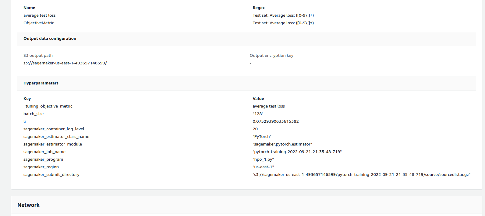
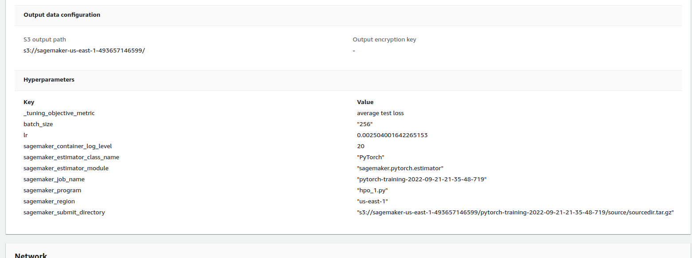
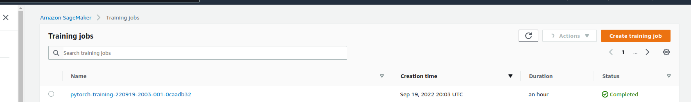
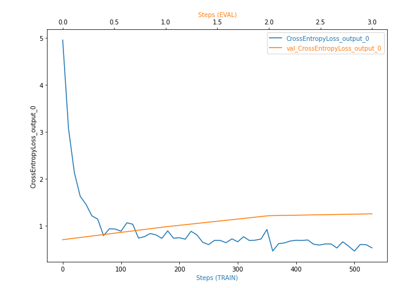
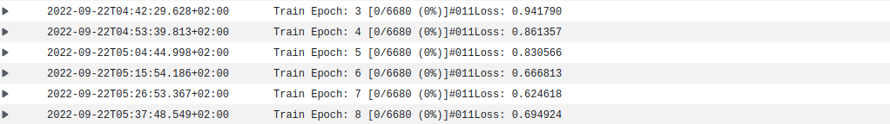

# Image Classification using AWS SageMaker

Use AWS Sagemaker to train a pretrained model that can perform image classification by using the Sagemaker profiling, debugger, hyperparameter tuning and other good ML engineering practices. This can be done on either the provided dog breed classication data set or one of your choice.

## Project Set Up and Installation
Enter AWS through the gateway in the course and open SageMaker Studio. 
Download the starter files.
Download/Make the dataset available. 

## Dataset
The provided dataset is the dogbreed classification dataset which can be found in the classroom.
The project is designed to be dataset independent so if there is a dataset that is more interesting or relevant to your work, you are welcome to use it to complete the project.

You can download the dataset [here](https://s3-us-west-1.amazonaws.com/udacity-aind/dog-project/dogImages.zip)

## Files Used in the project

- `hpo_1.py` - It contains functions that used to load dataset into loader, create the model, traing the model and test it all that is used by the hyperparameter tuning jobs to train and test the models with different hyperparameters
- `train_model.py` - It contains functions that used to load dataset into loader, create the model, traing the model and test it all that is used by the estimator to train the model with the best hyperparameters that we got from hyperparameter tuning
- `inference.py` - its the entry_point that is used by the deployed endpoint to feed the input image to the deployed model and send back the prediction.
- `train_and_deploy.ipynb` - This jupyter notebook is the main code that calls all other files and all the steps are done in it with its output shown.

### Access
Upload the data to an S3 bucket through the AWS Gateway so that SageMaker has access to the data. 

## Hyperparameter Tuning
What kind of model did you choose for this experiment and why? Give an overview of the types of parameters and their ranges used for the hyperparameter search
I used Resnet50 as from my previous practice it was fit for that type of image classification
changed hyper parameters for learning rate and batch size:
"lr": (0.001, 0.1),
"batch_size": [128, 256]

the best hyperparameters was: 
'batch_size': '"256"'
'lr': '0.002504001642265153'

## Training job:

## Debugging and Profiling
**TODO**: Give an overview of how you performed model debugging and profiling in Sagemaker
Although I have good experience in working with pytorch but working with sagemaker is a very different experience as i could do many training with different hyperparameters in a single run and with parallel instances

### Results
**TODO**: What are the results/insights did you get by profiling/debugging your model?

**TODO** Remember to provide the profiler html/pdf file in your submission.

## Model Deployment
**TODO**: Give an overview of the deployed model and instructions on how to query the endpoint with a sample input.
I had a previous experience in deploying models on sagemaker but with a localy trained model with a model trained on sagemaker it was much easier
I used "ml.t2.medium" for the instance type and used entry_point "inference.py" which takes json file containing s3 path for the image 

**TODO** Remember to provide a screenshot of the deployed active endpoint in Sagemaker.

## Standout Suggestions
**TODO (Optional):** This is where you can provide information about any standout suggestions that you have attempted.
I tried to use many instances types specially for training also tried to slightly change the training function we used in the lesson

